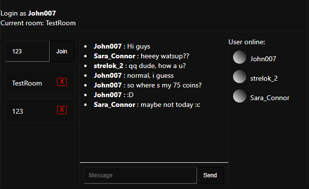

# Menu
- [About](#about)
- [Usage](#usage)

# <a name="about">About</a> 
Simple socket.io chat on React. Server + Client

What we have?

- Rooms list
- Users list to current room
- Messages is stored in client local storage 

# <a name="usage">Usage</a>
Server: npm run dev
Client: npm start

You can change chat size in App.css :)
